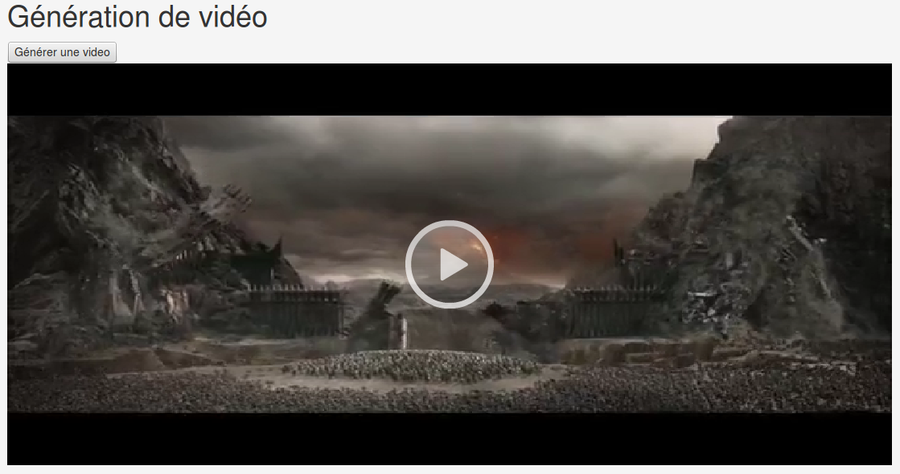
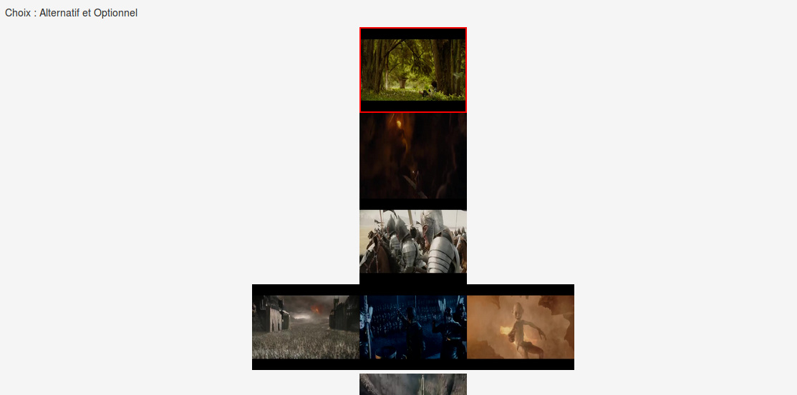

# Videogen

Romain RAMAGE && Tanguy BERNARD

##Objectif
L’objectif de ce projet est de déployer un générateur ou configurateur Web de vidéos à partir d’une spécification textuelle (VideoGen). Les utilisateurs du site Web pourront par exemple visualiser des variantes de vidéos générées aléatoirement ou avec des probabilités. 

##Instalation
1. Récuperer le projet.
2. tar -zxvf jhipster/src/main/webapp/resources/video.tar.gz

##Execution
1. cd jhipster/
2. mvn

##Utilisation
Après l'authentification (admin/admin). Deux choix s'offrent à vous:
- Vidéo: Une génération aléatoire à partir de vidéo sélectionné qui tiens compte des probabilités.

- Vignettes: Une génération définit par vos choix optionnels et alternatifs (avec une intro et conclusion obligatoire).

